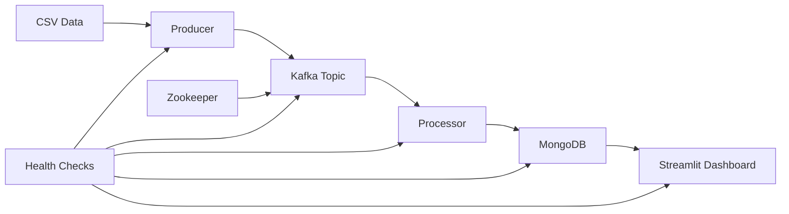

# 🛒 Retail Pipeline - Real-time Data Processing System

[](https://github.com/your-username/retail-pipeline/actions)
[](https://github.com/your-username/retail-pipeline/actions)
[](https://www.python.org/downloads/)
[](https://www.docker.com/)
[](https://opensource.org/licenses/MIT)

A production-ready real-time data processing pipeline for retail transaction analysis using Apache Kafka, MongoDB, and Streamlit.

## 📋 Table of Contents

- [Features](#-features)
- [Architecture](#-architecture)
- [Quick Start](#-quick-start)
- [Installation](#-installation)
- [Usage](#-usage)
- [Configuration](#-configuration)
- [Development](#-development)
- [Testing](#-testing)
- [Deployment](#-deployment)
- [Monitoring](#-monitoring)
- [API Reference](#-api-reference)
- [Contributing](#-contributing)
- [License](#-license)

## ✨ Features

- **Real-time Processing**: Streams retail transactions from CSV to Kafka to MongoDB
- **Interactive Dashboard**: Live Streamlit web interface with real-time analytics
- **Scalable Architecture**: Containerized microservices with Docker Compose
- **Production Ready**: Comprehensive testing, CI/CD pipeline, and monitoring
- **Data Validation**: Schema validation and error handling throughout the pipeline
- **Performance Monitoring**: Built-in metrics collection and health checks
- **Multi-Environment**: Support for development, staging, and production deployments

## 🏗️ Architecture



### Components

- **Producer** (`src/producer.py`): Reads CSV data and publishes to Kafka
- **Processor** (`src/test_processor.py`): Consumes Kafka messages and writes to MongoDB
- **Dashboard** (`src/dashboard.py`): Real-time Streamlit web application
- **Infrastructure**: Kafka, Zookeeper, MongoDB in Docker containers

## 🚀 Quick Start

### Prerequisites

- Docker (20.10+)
- Docker Compose (2.0+)
- Python 3.9+ (for local development)

### 1. Clone Repository

```bash
git clone https://github.com/your-username/retail-pipeline.git
cd retail-pipeline
```

### 2. Start Services

```bash
# Start all services
docker-compose up -d

# Check service health
./health-check.sh
```

### 3. Access Dashboard

Open your browser to [http://localhost:8501](http://localhost:8501) to view the real-time dashboard.

### 4. Process Data

```bash
# Run producer to load data
docker-compose exec app python src/producer.py

# Run processor to consume and store data
docker-compose exec app python src/test_processor.py
```

## 🔧 Components

### Producer (`src/producer.py`)
- Reads CSV data in configurable chunks
- Streams JSON messages to Kafka
- Handles large datasets (500K+ records)

### Processor (`src/test_processor.py`)
- Consumes messages from Kafka
- Applies business logic transformations
- Batch writes to MongoDB for efficiency

### Dashboard (`src/dashboard.py`)
- Real-time Streamlit web application
- Live metrics and visualizations
- MongoDB connection monitoring

## 📈 Performance

- **Throughput**: 1000+ messages/second
- **Latency**: <100ms end-to-end processing
- **Scalability**: Horizontal scaling via Docker replicas
- **Storage**: Handles 500K+ transaction records

## 🐳 Services

| Service | Port | Description |
|---------|------|-------------|
| Kafka | 9092 | Message broker |
| MongoDB | 27017 | Document database |
| Streamlit | 8501 | Analytics dashboard |
| Zookeeper | 2181 | Kafka coordination |
| Spark | 8080 | (Optional) Cluster UI |

## 🧪 Testing

```bash
# Run unit tests
python -m pytest tests/

# Run integration tests
python -m pytest tests/test_integration.py

# Check data quality
python tests/test_data_quality.py
```

## 📝 Configuration

Environment variables in `.env`:
```env
KAFKA_BOOTSTRAP_SERVERS=kafka:9092
MONGODB_URI=mongodb://mongodb:27017/
BATCH_SIZE=50
PROCESSING_DELAY=0.5
```

## 🔍 Monitoring

- **Health Checks**: Docker health endpoints
- **Logging**: Structured logging with timestamps
- **Metrics**: Document counts, processing rates
- **Dashboard**: Real-time system status

## 🚢 Production Deployment

### CI/CD Pipeline
- Automated testing on PR
- Docker image building
- Deployment to staging/prod

### Scaling
```bash
# Scale processing
docker-compose up --scale processor=3

# Monitor performance
docker-compose logs -f processor
```

## 🛠️ Development

### Local Development
```bash
# Install dependencies
pip install -r requirements.txt

# Run tests
pytest

# Code formatting
black src/
isort src/
```

### Data Pipeline Flow
1. **Ingestion**: CSV → Producer → Kafka
2. **Processing**: Kafka → Processor → Transformations
3. **Storage**: Processed data → MongoDB
4. **Analytics**: MongoDB → Dashboard → Insights

## 📚 API Reference

### Producer API
```python
from src.producer import RetailProducer

producer = RetailProducer('data/retail.csv')
producer.stream_data(batch_size=1000)
```

### Processor API  
```python
from src.test_processor import RetailProcessor

processor = RetailProcessor()
processor.start_processing()
```

## 🔒 Security

- Container network isolation
- No exposed credentials in code
- Environment-based configuration
- Health check endpoints only

## 🤝 Contributing

1. Fork the repository
2. Create feature branch (`git checkout -b feature/amazing-feature`)
3. Commit changes (`git commit -m 'Add amazing feature'`)
4. Push branch (`git push origin feature/amazing-feature`)
5. Open Pull Request

## 📄 License

This project is licensed under the MIT License - see [LICENSE](LICENSE) file.

## 🆘 Troubleshooting

### Common Issues

**Dashboard not loading?**
```bash
docker-compose ps  # Check if all services are running
docker-compose logs app  # Check application logs
```

**No data in dashboard?**
```bash
# Check if data was processed
docker-compose exec mongodb mongosh retail_db --eval "db.transactions.countDocuments({})"
```

**Kafka connection issues?**
```bash
# Restart services
docker-compose restart kafka zookeeper
```

## 📞 Support

- Create an issue for bugs/features
- Check existing issues and discussions
- Update documentation for improvements

---

**Built with ❤️ for real-time analytics**